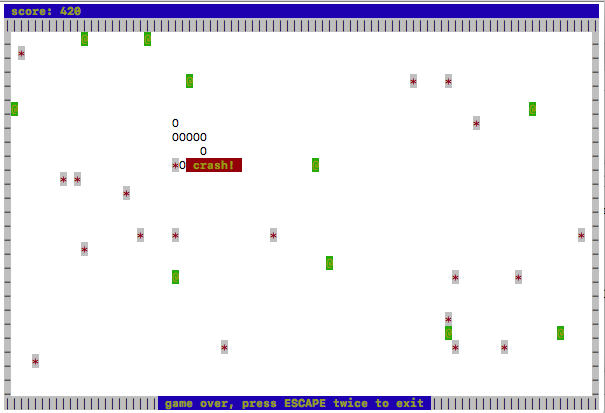

# cppsnake
A simple C++ implementation of Snake, using the scape and keys terminal and keyboard input libraries, respectively

This is a demo project to show what scape and keys can do.
At this point scape has not been made header-only, and keys is not even spun out into it's own project.
Both libraries are currently ANSI/ *Nix specific and have only been tested on my Mac using clang.
